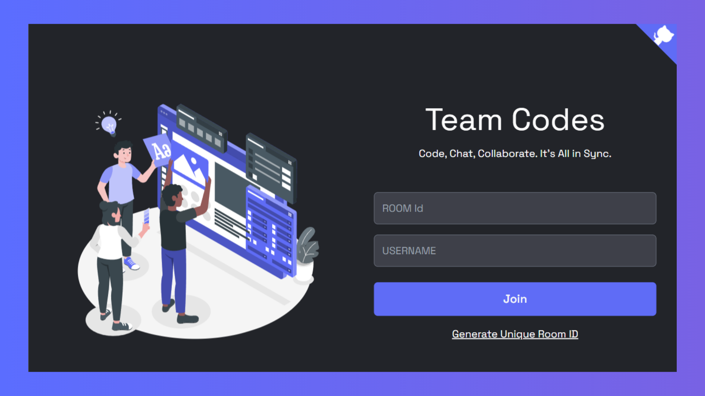

# Team Codes - Live Collaborative Code Editor



Team Codes is a collaborative, real-time code editor where users can seamlessly code together. It provides a platform for multiple users to enter a room, share a unique room ID, and collaborate on code simultaneously.


## 🔮 Features

- 💻 Seamless real-time collaboration on code editing across various files
- 🚀 Innovative room generation featuring unique room IDs to facilitate collaboration
- 🌈 Dynamic syntax highlighting for a diverse range of file types, coupled with automatic language detection
- 💡 Intelligent auto-suggestion based on the programming language in use
- ⏱️ Swift and instantaneous updates ensuring synchronization of code changes across all files
- 📣 Noteworthy notifications alerting users about join and leave events
- 🎨 A plethora of themes available for a personalized and visually appealing coding experience
- 🌍 Extensive language support catering to a wide spectrum of programming languages
- 🔠 Flexibility to customize font size and font family to suit individual preferences
- 👥 User presence list providing real-time information on participants in the collaboration session, complete with online/offline status indicators
- 📁 Effortless management with open, edit, save, and delete file functionalities
- 💾 Convenient option to download files edited during the collaboration session
- 💬 Engage in group chatting for effective real-time communication while actively collaborating on code.

## 🚀 Live Preview

Live Project [here](https://team-codes-rx38.onrender.com).

## 💻 Tech Stack


## ⚙️ Installation

1. **Fork this repository:** Click the Fork button located in the top-right corner of this page to fork the repository.
2. **Clone the repository:**
   ```bash
   git clone https://github.com/<your-username>/Code-Sync.git
   ```
3. **Set .env file:**
   Inside the client and server directory, create or edit the .env file and add the following line:  
   Frontend:

   ```bash
   VITE_BACKEND_URL=<your_server_url>
   ```

   Backend:

   ```bash
   PORT=3000
   MONGO_URI=<your_mongodb_connection_string>
   ```

4. **Install dependencies:**
   Navigate to the frontend and backend directories separately and run:
   ```bash
    npm install
   ```
5. **Start the frontend and backend servers:**  
   Frontend:
   ```bash
   cd client
   npm run dev
   ```
   Backend:
   ```bash
   cd server
   npm run dev
   ```
6. **Access the application:**
   Open a browser and enter the following URL:
   ```bash
   http://localhost:5173/
   ```

## 🔮 Features for next release

- **Login/SignUp:** Currently the site does not implements maitaing user account rather than that it follows quick use and anonymity but we can bring permanant user concept here so lets try that.
- **Search and Replace:** Implement a search and replace functionality for efficient code navigation.
- **Storing the files:** All the files will be saved with user account if host gives access.

## 🤝 Contribute

We welcome contributions to make Team Codes even better! Whether you're reporting a bug, suggesting a new feature, or fixing a typo, your input is valuable to me. Follow the [contribution guidelines](CONTRIBUTING.md) to get started.

## 🌟 Support Us

If you find this helpful or valuable, please consider 🌟 starring the repository. It helps me gain visibility and encourages further development. We appreciate your support!

## 🧾 License

This project is licensed under the [MIT License](LICENSE).
